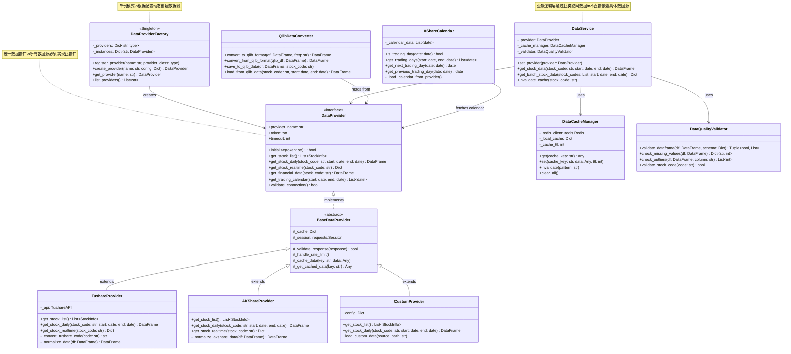
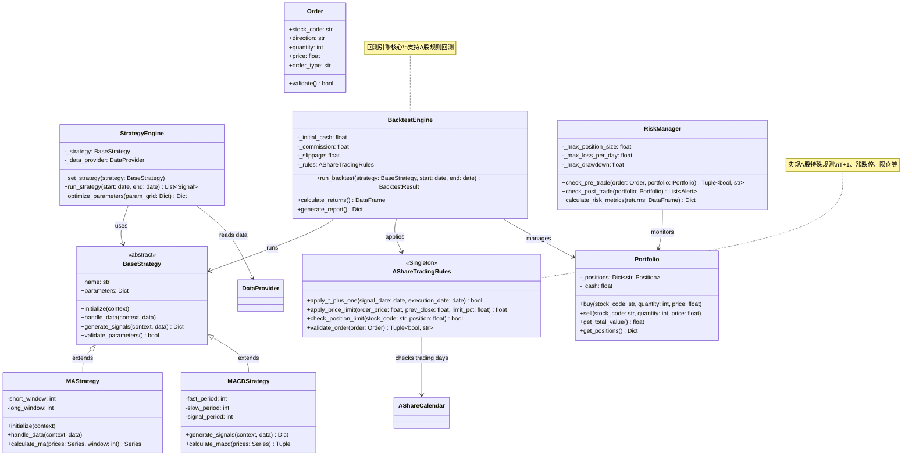
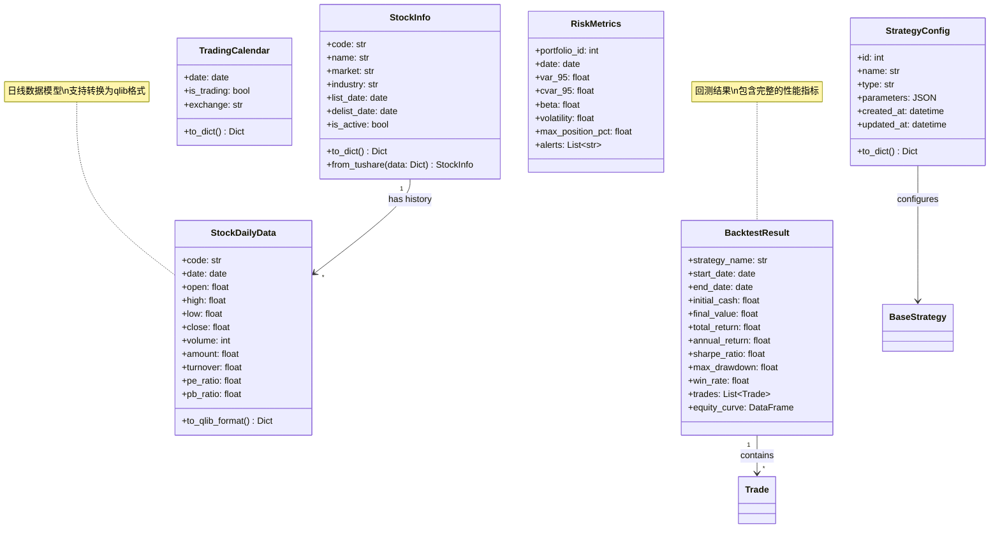
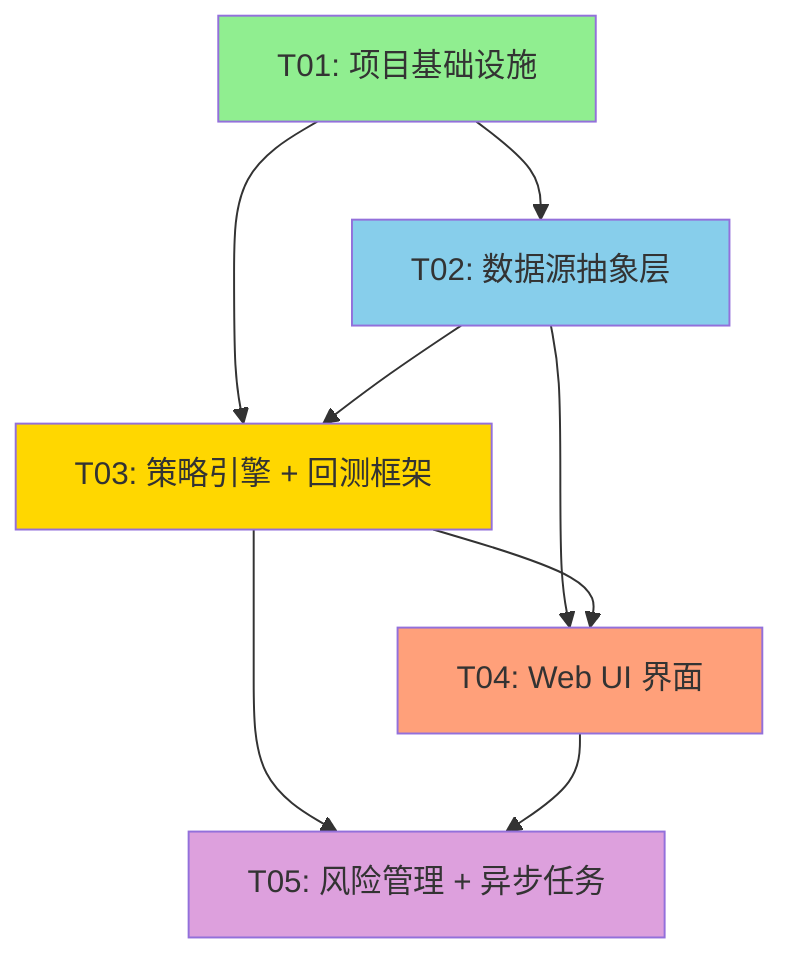

# 系统架构设计文档
## A股量化交易选股系统（基于 qlib 框架）

**架构师**: Bob  
**版本**: v1.0  
**日期**: 2024-02-24  

---

## Part A: 系统设计

### 1. 实现方案

#### 1.1 核心技术挑战

1. **A股特有问题**:
   - 股票代码格式适配（sh.600000, sz.000001）
   - T+1 交易规则实现
   - 涨跌停限制（10%/20%/30%）
   - 科创板、创业板特殊规则
   - A股交易日历（剔除节假日、调休）

2. **数据源解耦**:
   - 统一数据接口设计
   - 多数据源适配器实现
   - 数据格式标准化
   - 缓存机制透明化

3. **qlib 框架集成**:
   - 理解 qlib 数据模型（Datalog）
   - 扩展 qlib 以支持 A 股特性
   - 回测引擎适配 A 股规则

#### 1.2 技术栈选型及理由

| 层级 | 技术选型 | 理由 |
|------|---------|------|
| **量化框架** | qlib 0.9.5+ | 微软开源，成熟的量化框架，支持A股扩展 |
| **Web 后端** | FastAPI 0.109+ | 高性能异步框架，自动生成 API 文档，适合数据接口 |
| **Web 前端** | React 18 + MUI 5 + Tailwind CSS | 组件化开发，MUI提供企业级组件，Tailwind快速样式开发 |
| **时序数据库** | qlib Datalog | qlib内置，优化金融时序数据，支持快速查询 |
| **关系数据库** | PostgreSQL 15+ | 存储业务数据（用户、策略、回测结果），支持JSON字段 |
| **缓存** | Redis 7+ | 数据缓存、任务队列中间层，支持发布订阅 |
| **任务队列** | Celery 5.3+ | 异步任务处理（数据下载、回测执行） |
| **数据源** | Tushare Pro + AKShare | Tushare数据质量高（需积分），AKShare免费开源 |
| **数据处理** | Pandas 2.1+ + NumPy 1.24+ | 金融数据标准处理库 |
| **技术分析** | TA-Lib 0.4.28+ | 技术指标计算标准库 |

#### 1.3 架构模式

**分层架构 + 插件化设计**

```
┌──────────────────────────────────────────────────┐
│           表现层 (Presentation Layer)              │
│  - Web UI (React + MUI)                          │
│  - REST API (FastAPI)                            │
└──────────────────────────────────────────────────┘
                      ↓
┌──────────────────────────────────────────────────┐
│          业务逻辑层 (Business Layer)               │
│  - Strategy Engine (策略引擎)                      │
│  - Backtest Engine (回测引擎)                      │
│  - Risk Manager (风险管理)                        │
└──────────────────────────────────────────────────┘
                      ↓
┌──────────────────────────────────────────────────┐
│         数据服务层 (Data Service Layer)            │
│  - Data Provider Interface (统一接口)              │
│  - Data Cache Manager (缓存管理)                   │
│  - Data Quality Validator (质量校验)               │
└──────────────────────────────────────────────────┘
                      ↓
┌──────────────────────────────────────────────────┐
│        数据源适配层 (Data Adapter Layer)           │
│  - TushareAdapter                                │
│  - AKShareAdapter                                │
│  - CustomAdapter (可扩展)                        │
└──────────────────────────────────────────────────┘
                      ↓
┌──────────────────────────────────────────────────┐
│         数据存储层 (Data Storage Layer)            │
│  - qlib Datalog (时序数据)                        │
│  - PostgreSQL (业务数据)                          │
│  - Redis (缓存数据)                               │
└──────────────────────────────────────────────────┘
```

**设计模式应用**:
- **适配器模式**: 数据源适配层，统一接口
- **工厂模式**: DataProviderFactory 动态创建数据源
- **策略模式**: 策略引擎，运行时切换策略
- **观察者模式**: 数据更新通知
- **依赖注入**: 业务逻辑依赖抽象接口

---

### 2. 文件列表

```
D:/quant/
├── docs/                                    # 文档目录
│   ├── Architecture-quant-system.md         # 本架构设计文档
│   ├── PRD-quant-system.md                 # 产品需求文档
│   ├── API-design.md                       # API 设计文档
│   └── deployment-guide.md                 # 部署指南
│
├── backend/                                 # 后端服务
│   ├── app/
│   │   ├── __init__.py
│   │   ├── main.py                         # FastAPI 应用入口
│   │   ├── config.py                       # 配置管理
│   │   ├── dependencies.py                 # 依赖注入
│   │   │
│   │   ├── api/                            # API 路由层
│   │   │   ├── __init__.py
│   │   │   ├── v1/
│   │   │   │   ├── __init__.py
│   │   │   │   ├── api.py                  # API 路由聚合
│   │   │   │   ├── endpoints/
│   │   │   │   │   ├── __init__.py
│   │   │   │   │   ├── stock.py            # 股票数据接口
│   │   │   │   │   ├── strategy.py         # 策略管理接口
│   │   │   │   │   ├── backtest.py         # 回测接口
│   │   │   │   │   ├── calendar.py         # 交易日历接口
│   │   │   │   │   └── risk.py             # 风险管理接口
│   │   │
│   │   ├── core/                           # 核心业务逻辑
│   │   │   ├── __init__.py
│   │   │   ├── security.py                 # 安全工具（JWT等）
│   │   │   └── config.py                   # 核心配置
│   │   │
│   │   ├── services/                       # 业务服务层
│   │   │   ├── __init__.py
│   │   │   ├── stock_service.py            # 股票数据服务
│   │   │   ├── strategy_service.py         # 策略服务
│   │   │   ├── backtest_service.py         # 回测服务
│   │   │   ├── risk_service.py             # 风险服务
│   │   │   └── calendar_service.py         # 日历服务
│   │   │
│   │   ├── data/                           # 数据层（重点设计）
│   │   │   ├── __init__.py
│   │   │   ├── interface.py                # ⭐ 数据提供者接口定义
│   │   │   ├── factory.py                  # ⭐ 数据提供者工厂
│   │   │   ├── cache.py                    # 数据缓存管理
│   │   │   ├── validator.py                # 数据质量校验
│   │   │   │
│   │   │   ├── providers/                 # 数据源适配器实现
│   │   │   │   ├── __init__.py
│   │   │   │   ├── base.py                 # 基类实现
│   │   │   │   ├── tushare_provider.py     # Tushare 适配器
│   │   │   │   ├── akshare_provider.py     # AKShare 适配器
│   │   │   │   └── custom_provider.py      # 自定义数据源模板
│   │   │   │
│   │   │   └── qlib_integration/          # qlib 集成模块
│   │   │       ├── __init__.py
│   │   │       ├── converter.py            # 数据格式转换
│   │   │       ├── calendar.py             # A股日历适配
│   │   │       └── data_loader.py          # qlib 数据加载器
│   │   │
│   │   ├── models/                         # 数据模型
│   │   │   ├── __init__.py
│   │   │   ├── stock.py                    # 股票数据模型
│   │   │   ├── strategy.py                 # 策略模型
│   │   │   ├── backtest.py                 # 回测结果模型
│   │   │   ├── risk.py                     # 风险指标模型
│   │   │   └── calendar.py                 # 交易日历模型
│   │   │
│   │   ├── strategies/                     # 策略库
│   │   │   ├── __init__.py
│   │   │   ├── base.py                     # 策略基类
│   │   │   ├── template.py                 # 策略模板
│   │   │   ├── alpha101/                   # Alpha101 因子策略
│   │   │   │   └── __init__.py
│   │   │   ├── technical/                 # 技术指标策略
│   │   │   │   ├── __init__.py
│   │   │   │   ├── ma_cross.py            # 均线交叉
│   │   │   │   └── macd_signal.py         # MACD信号
│   │   │   └── custom/                     # 用户自定义策略
│   │   │       └── __init__.py
│   │   │
│   │   ├── backtest/                       # 回测引擎（A股适配）
│   │   │   ├── __init__.py
│   │   │   ├── engine.py                   # 回测引擎核心
│   │   │   ├── rules.py                    # A股交易规则（T+1、涨跌停）
│   │   │   ├── executor.py                 # 订单执行器
│   │   │   └── analyzer.py                 # 回测结果分析
│   │   │
│   │   ├── risk/                           # 风险管理模块
│   │   │   ├── __init__.py
│   │   │   ├── manager.py                  # 风险管理器
│   │   │   ├── limits.py                   # 限仓限损逻辑
│   │   │   └── monitor.py                  # 风险监控
│   │   │
│   │   └── db/                             # 数据库层
│   │       ├── __init__.py
│   │       ├── session.py                  # 数据库会话
│   │       ├── models.py                   # SQLAlchemy 模型
│   │       └── init_db.py                  # 数据库初始化
│   │
│   ├── tests/                              # 测试代码
│   │   ├── __init__.py
│   │   ├── conftest.py                     # pytest 配置
│   │   ├── test_data_providers/            # 数据源测试
│   │   ├── test_strategies/                # 策略测试
│   │   ├── test_backtest/                  # 回测测试
│   │   └── test_api/                       # API 测试
│   │
│   ├── requirements.txt                    # Python 依赖
│   ├── pyproject.toml                      # 项目配置
│   └── .env.example                        # 环境变量示例
│
├── frontend/                               # 前端项目
│   ├── public/
│   │   └── index.html
│   ├── src/
│   │   ├── App.tsx                         # 应用根组件
│   │   ├── index.tsx                       # 入口文件
│   │   ├── api/                            # API 调用层
│   │   │   ├── client.ts                   # Axios 实例
│   │   │   ├── stockApi.ts                 # 股票数据 API
│   │   │   ├── strategyApi.ts              # 策略 API
│   │   │   └── backtestApi.ts              # 回测 API
│   │   ├── components/                     # 通用组件
│   │   │   ├── Layout/
│   │   │   ├── StockSelector/              # 股票选择器
│   │   │   ├── StrategyCard/               # 策略卡片
│   │   │   └── BacktestChart/              # 回测图表
│   │   ├── pages/                          # 页面组件
│   │   │   ├── Dashboard/
│   │   │   ├── StockList/
│   │   │   ├── StrategyManager/
│   │   │   ├── BacktestRunner/
│   │   │   └── RiskMonitor/
│   │   ├── store/                          # 状态管理
│   │   │   ├── index.ts
│   │   │   ├── stockSlice.ts
│   │   │   ├── strategySlice.ts
│   │   │   └── backtestSlice.ts
│   │   ├── types/                          # TypeScript 类型
│   │   │   ├── stock.ts
│   │   │   ├── strategy.ts
│   │   │   └── backtest.ts
│   │   └── utils/                          # 工具函数
│   │       ├── format.ts                   # 格式化工具
│   │       └── constants.ts                # 常量定义
│   ├── package.json
│   ├── tsconfig.json
│   ├── tailwind.config.js
│   └── vite.config.ts
│
├── qlib-source/                            # qlib 源码（参考）
│   └── (qlib 官方源码)
│
├── data/                                   # 数据目录
│   ├── qlib_data/                          # qlib 数据存放
│   ├── cache/                              # 缓存数据
│   └── exports/                            # 导出数据
│
├── scripts/                                # 脚本工具
│   ├── setup.sh                            # 环境安装脚本
│   ├── init_data.py                        # 数据初始化脚本
│   ├── download_stock_data.py              # 股票数据下载
│   └── run_backtest.py                     # 回测执行脚本
│
├── docker/                                 # Docker 配置
│   ├── Dockerfile.backend
│   ├── Dockerfile.frontend
│   ├── docker-compose.yml
│   └── .dockerignore
│
└── .github/                                # CI/CD
    └── workflows/
        ├── ci.yml
        └── cd.yml
```

---

### 3. 数据结构和接口（类图）

#### 3.1 核心类图 - 数据源抽象层（重点设计）



#### 3.2 策略与回测类图



#### 3.3 数据模型类图



---

### 4. 程序调用流程（时序图）

#### 4.1 数据获取流程

```mermaid
sequenceDiagram
    participant User as 用户/前端
    participant API as FastAPI Endpoint
    participant Service as DataService
    participant Cache as DataCacheManager
    participant Provider as DataProvider
    participant Qlib as QlibDataConverter
    participant DB as qlib Datalog
    
    User->>API: GET /api/v1/stocks/{code}/daily?start=2024-01-01&end=2024-12-31
    API->>Service: get_stock_daily(code, start, end)
    
    alt 检查缓存
        Service->>Cache: get(cache_key)
        Cache-->>Service: cached_data or None
        
        alt 缓存命中
            Service-->>API: return cached_data
            API-->>User: return JSON response
        else 缓存未命中
            Service->>Provider: get_stock_daily(code, start, end)
            Provider->>Provider: validate_stock_code(code)
            Provider->>Provider: fetch from external API
            Provider-->>Service: return DataFrame
            
            Service->>Service: validate_data(df)
            Service->>Cache: set(cache_key, df, ttl=3600)
            
            opt 保存到qlib格式
                Service->>Qlib: convert_to_qlib_format(df)
                Qlib->>DB: save_to_qlib_data(df, code)
            end
            
            Service-->>API: return df
            API-->>User: return JSON response
        end
    end
    
    note over Service,Provider "数据源可随时切换<br/>通过DataProviderFactory创建"
```

#### 4.2 策略回测流程

```mermaid
sequenceDiagram
    participant User as 用户
    participant API as FastAPI
    participant Engine as BacktestEngine
    participant Strategy as BaseStrategy
    participant Rules as AShareTradingRules
    participant Data as DataService
    participant Portfolio as Portfolio
    participant Risk as RiskManager
    
    User->>API: POST /api/v1/backtest/run
    Note over User,API: {strategy: "MAStrategy", params: {...}, start: date, end: date}
    
    API->>Engine: run_backtest(strategy_config)
    
    Engine->>Engine: initialize backtest
    Engine->>Strategy: initialize(context)
    
    loop 每个交易日
        Engine->>Data: get_stock_data(codes, date)
        Data-->>Engine: return market data
        
        Engine->>Strategy: handle_data(context, data)
        Strategy->>Strategy: generate_signals(data)
        Strategy-->>Engine: return signals
        
        alt 有交易信号
            Engine->>Rules: validate_order(order)
            Rules-->>Engine: (is_valid, message)
            
            if is_valid
                Engine->>Portfolio: execute_order(order)
                Engine->>Risk: check_post_trade(portfolio)
                Risk-->>Engine: alerts
            end
        end
        
        Engine->>Portfolio: mark_to_market(data)
    end
    
    Engine->>Engine: calculate_returns()
    Engine->>Engine: generate_report()
    
    Engine-->>API: return BacktestResult
    API-->>User: return JSON response
    
    note over Engine,Rules "严格遵守A股规则<br/>T+1、涨跌停、限仓"
```

#### 4.3 数据源切换流程

```mermaid
sequenceDiagram
    participant Admin as 管理员
    participant Config as Config File
    participant Factory as DataProviderFactory
    participant OldProvider as OldDataProvider
    participant NewProvider as NewDataProvider
    participant Service as DataService
    
    Admin->>Config: update config.yaml
    Note over Admin,Config: data_provider: "akshare"<br/># was "tushare"
    
    Config->>Factory: reload_config()
    
    Factory->>Factory: create_provider("akshare")
    Factory->>NewProvider: __init__(config)
    NewProvider-->>Factory: return instance
    
    Factory->>Service: set_provider(new_provider)
    
    opt 可选：数据迁移
        Service->>OldProvider: export_data()
        OldProvider-->>Service: return data
        Service->>NewProvider: import_data(data)
    end
    
    note over Service,NewProvider "业务代码无需修改<br/>仅通过配置切换数据源"
```

---

### 5. 待明确事项 (Anything UNCLEAR)

#### 5.1 需要用户确认的问题

1. **数据源优先级**:
   - Q: Tushare 和 AKShare 的优先级？是否同时启用多个数据源做冗余？
   - 建议: 主数据源用 Tushare（质量高），备用 AKShare（免费）

2. **qlib 版本和集成方式**:
   - Q: 是 pip install qlib 还是直接修改 qlib 源码？
   - 建议: 先 pip 安装，再通过继承/猴子补丁方式扩展

3. **Web UI 的功能范围**:
   - Q: P1 的 Web UI 是第一版 MVP 还是完整功能？
   - 建议: 第一版先做数据查看 + 策略回测，风险管理放后

4. **实盘交易接口**:
   - Q: P2 的实盘交易接口，目标是对接哪些券商？
   - 建议: 先完成回测，实盘留接口不实现

5. **部署环境**:
   - Q: 部署在本地还是云服务器？需要 Docker 化吗？
   - 建议: 提供 Docker Compose 一键部署

#### 5.2 技术假设

1. **Python 版本**: 假设使用 Python 3.10+（qlib 支持）
2. **操作系统**: 假设 Linux/macOS（Windows 需 WSL2）
3. **数据源 token**: 假设用户已有 Tushare token
4. **数据库**: 假设 PostgreSQL 和 Redis 可连接
5. **网络环境**: 假设可访问外网（下载数据）

#### 5.3 风险和限制

1. **Tushare 积分限制**: 免费用户有调用频率限制，需做好缓存和限流
2. **AKShare 稳定性**: 开源项目，接口可能变动，需做好异常处理
3. **qlib 学习曲线**: 团队需时间熟悉 qlib 数据格式和 API
4. **A股规则复杂性**: 不同板块（主板/科创板/创业板）规则不同，需分别处理

---

## Part B: 任务分解

### 6. 依赖包列表 (Required Packages)

#### 6.1 Python 依赖 (backend/requirements.txt)

```txt
# ===== 核心框架 =====
fastapi==0.109.0
uvicorn[standard]==0.27.0
pydantic==2.5.3
pydantic-settings==2.1.0

# ===== 量化框架 =====
pyqlib==0.9.5
numpy==1.24.4
pandas==2.1.4
ta-lib==0.4.28

# ===== 数据源 =====
tushare==1.4.18
akshare==1.12.75

# ===== 数据库 =====
sqlalchemy==2.0.25
psycopg2-binary==2.9.9
redis==5.0.1

# ===== 任务队列 =====
celery==5.3.6
flower==2.0.1

# ===== 工具库 =====
python-dotenv==1.0.0
PyYAML==6.0.1
requests==2.31.0
aiohttp==3.9.1
pandas-ta==0.3.14b
joblib==1.3.2
diskcache==5.6.3

# ===== API 工具 =====
python-jose[cryptography]==3.3.0
passlib[bcrypt]==1.7.4
python-multipart==0.0.6
httpx==0.26.0

# ===== 日志和监控 =====
loguru==0.7.2
prometheus-client==0.19.0

# ===== 测试 =====
pytest==7.4.3
pytest-asyncio==0.21.1
pytest-cov==4.1.0
httpx==0.26.0

# ===== 开发工具 =====
black==23.12.0
isort==5.13.2
flake8==7.0.0
mypy==1.8.0
pre-commit==3.6.0
```

#### 6.2 前端依赖 (frontend/package.json)

```json
{
  "dependencies": {
    "react": "^18.2.0",
    "react-dom": "^18.2.0",
    "react-router-dom": "^6.21.0",
    "@mui/material": "^5.14.0",
    "@mui/icons-material": "^5.14.0",
    "@emotion/react": "^11.11.0",
    "@emotion/styled": "^11.11.0",
    "tailwindcss": "^3.4.0",
    "axios": "^1.6.0",
    "@reduxjs/toolkit": "^2.0.0",
    "react-redux": "^9.0.0",
    "recharts": "^2.10.0",
    "dayjs": "^1.11.10",
    "zod": "^3.22.0",
    "react-hook-form": "^7.48.0"
  },
  "devDependencies": {
    "typescript": "^5.3.0",
    "vite": "^5.0.0",
    "@types/react": "^18.2.0",
    "@types/react-dom": "^18.2.0",
    "eslint": "^8.56.0",
    "prettier": "^3.1.0"
  }
}
```

---

### 7. 任务列表（有序、含依赖关系）

#### ⚠️ 任务分解说明

根据架构设计原则，我将所有功能分解为 **5个任务**，每个任务包含多个相关文件，确保：
- 任务数量 ≤ 5（硬性上限）
- 每个任务 ≥ 3 个文件
- 按依赖关系排序
- 第一个任务是基础设施

---

#### **Task T01: 项目基础设施 + 配置 + 入口文件**

**优先级**: P0  
**依赖**: 无  
**描述**: 搭建项目基础结构，配置开发环境，创建应用入口

**涉及文件**:
```
backend/
├── app/
│   ├── __init__.py
│   ├── main.py                     # FastAPI 应用入口
│   ├── config.py                   # 配置管理（Pydantic Settings）
│   └── dependencies.py             # 依赖注入
├── requirements.txt                # Python 依赖
├── pyproject.toml                  # 项目配置
├── .env.example                    # 环境变量模板
└── tests/
    ├── __init__.py
    └── conftest.py                 # pytest 配置

frontend/
├── package.json                    # Node 依赖
├── tsconfig.json                   # TypeScript 配置
├── vite.config.ts                  # Vite 配置
├── tailwind.config.js              # Tailwind 配置
├── public/index.html
└── src/
    ├── App.tsx                     # React 根组件
    ├── index.tsx                   # 入口文件
    └── api/client.ts               # Axios 实例

docker/
├── docker-compose.yml              # 本地开发环境
├── Dockerfile.backend
└── .dockerignore

scripts/
└── setup.sh                        # 环境安装脚本
```

**实现要点**:
1. 创建 FastAPI 应用，配置 CORS、日志、错误处理
2. 使用 Pydantic Settings 管理配置（支持 .env 文件）
3. 配置依赖注入容器（数据源、服务等）
4. 创建前端 React 应用，配置 MUI + Tailwind
5. 配置 Docker Compose（PostgreSQL + Redis + Backend + Frontend）
6. 创建 `.env.example` 模板（包含 Tushare token 等配置）

**验收标准**:
- [ ] `docker-compose up` 可启动所有服务
- [ ] 访问 `http://localhost:8000/docs` 看到 FastAPI 文档
- [ ] 访问 `http://localhost:3000` 看到前端页面
- [ ] `.env` 配置文件加载成功

---

#### **Task T02: 数据源抽象层 + A股适配**

**优先级**: P0  
**依赖**: T01  
**描述**: 实现数据源抽象层（核心设计），支持 Tushare/AKShare 适配器，A股日历适配

**涉及文件**:
```
backend/app/
├── data/
│   ├── __init__.py
│   ├── interface.py                # DataProvider 接口定义
│   ├── factory.py                  # DataProviderFactory 工厂类
│   ├── cache.py                    # DataCacheManager 缓存管理
│   ├── validator.py                # DataQualityValidator 质量校验
│   ├── providers/
│   │   ├── __init__.py
│   │   ├── base.py                 # BaseDataProvider 基类
│   │   ├── tushare_provider.py     # Tushare 适配器
│   │   ├── akshare_provider.py     # AKShare 适配器
│   │   └── custom_provider.py      # 自定义数据源模板
│   └── qlib_integration/
│       ├── __init__.py
│       ├── converter.py            # 数据格式转换（to/from qlib）
│       ├── calendar.py             # A股交易日历
│       └── data_loader.py          # qlib 数据加载器
├── models/
│   ├── stock.py                    # StockInfo, StockDailyData 模型
│   └── calendar.py                 # TradingCalendar 模型
└── api/v1/endpoints/
    ├── stock.py                    # 股票数据 API
    └── calendar.py                 # 交易日历 API
```

**实现要点**:
1. **定义 DataProvider 接口**（`interface.py`）:
   - `get_stock_list() -> List[StockInfo]`
   - `get_stock_daily(code, start, end) -> DataFrame`
   - `get_stock_realtime(code) -> Dict`
   - `get_trading_calendar(start, end) -> List[date]`
   - 所有数据源必须实现此接口

2. **实现工厂模式**（`factory.py`）:
   - 单例模式，全局共享
   - `create_provider(name, config)` 根据配置创建数据源
   - 支持运行时切换数据源

3. **实现 Tushare 适配器**（`tushare_provider.py`）:
   - 处理 Tushare 返回的数据格式
   - 股票代码转换（sh.600000 ↔ 600000.SH）
   - 异常处理和重试机制

4. **实现 AKShare 适配器**（`akshare_provider.py`）:
   - 类似 Tushare 适配器
   - AKShare 接口变动较大，需做好兼容

5. **A股日历适配**（`calendar.py`）:
   - 从数据源获取交易日历
   - 实现 `is_trading_day()`, `get_trading_days()` 等方法
   - 考虑节假日调休

6. **数据缓存管理**（`cache.py`）:
   - 使用 Redis 缓存热门股票数据
   - 本地内存缓存 + Redis 二级缓存
   - 缓存失效策略（按股票代码 + 日期范围）

**验收标准**:
- [ ] 可通过配置文件切换 Tushare/AKShare
- [ ] `DataProviderFactory.create_provider("tushare", config)` 返回正确实例
- [ ] 调用 `get_stock_list()` 返回标准化的 StockInfo 列表
- [ ] 调用 `get_stock_daily()` 返回 Pandas DataFrame
- [ ] A股日历正确判断交易日（测试2024-02-24是周六，非交易日）
- [ ] 数据缓存生效，重复查询不重复调用 API

---

#### **Task T03: 策略引擎 + 回测框架（A股规则）**

**优先级**: P0  
**依赖**: T02  
**描述**: 实现策略基类、预置策略、回测引擎，适配 A 股 T+1 和涨跌停规则

**涉及文件**:
```
backend/app/
├── strategies/
│   ├── __init__.py
│   ├── base.py                     # BaseStrategy 策略基类
│   ├── template.py                 # 策略模板（供用户自定义）
│   ├── technical/
│   │   ├── __init__.py
│   │   ├── ma_cross.py            # 均线交叉策略
│   │   ├── macd_signal.py         # MACD 信号策略
│   │   └── rsi_strategy.py        # RSI 策略
│   └── alpha101/
│       └── __init__.py             # Alpha101 因子策略（可选）
├── backtest/
│   ├── __init__.py
│   ├── engine.py                   # BacktestEngine 回测引擎
│   ├── rules.py                    # AShareTradingRules A股规则
│   ├── executor.py                 # OrderExecutor 订单执行器
│   └── analyzer.py                 # BacktestAnalyzer 结果分析
├── models/
│   ├── strategy.py                 # StrategyConfig 模型
│   └── backtest.py                 # BacktestResult, Trade 模型
├── services/
│   ├── strategy_service.py         # 策略服务（CRUD）
│   └── backtest_service.py         # 回测服务（执行回测）
└── api/v1/endpoints/
    ├── strategy.py                 # 策略管理 API
    └── backtest.py                 # 回测 API
```

**实现要点**:
1. **策略基类**（`base.py`）:
   - 定义 `initialize()`, `handle_data()`, `generate_signals()` 方法
   - 参数验证和持久化
   - 支持参数优化（网格搜索）

2. **预置策略**:
   - 均线交叉策略（短均线穿过长均线买入）
   - MACD 策略（DIF 上穿 DEA 买入）
   - RSI 策略（超买超卖）
   - 所有策略继承自 BaseStrategy

3. **A股交易规则**（`rules.py`）:
   - **T+1 规则**: 当天买入，下一个交易日才能卖出
   - **涨跌停限制**: 主板 ±10%，科创板/创业板 ±20%
   - **限仓规则**: 单只股票持仓不超过投资组合的一定比例
   - **订单验证**: 在 OrderExecutor 执行前验证

4. **回测引擎**（`engine.py`）:
   - 事件驱动回测（按交易日迭代）
   - 计算回测指标（收益率、夏普比率、最大回撤等）
   - 生成权益曲线和交易记录

5. **API 接口**:
   - `POST /api/v1/strategies` 创建策略
   - `POST /api/v1/backtest/run` 运行回测
   - `GET /api/v1/backtest/{id}/results` 获取回测结果

**验收标准**:
- [ ] 创建 MAStrategy 实例，设置参数
- [ ] 运行回测，返回 BacktestResult
- [ ] 回测结果包含 `total_return`, `sharpe_ratio`, `max_drawdown`
- [ ] T+1 规则生效（无法当天卖出）
- [ ] 涨跌停限制生效（订单价格超限价则无效）
- [ ] 权益曲线数据可用于前端绘图

---

#### **Task T04: Web UI 界面 + 状态管理**

**优先级**: P1  
**依赖**: T02, T03  
**描述**: 实现 Web UI 界面，包括股票数据查看、策略管理、回测结果展示

**涉及文件**:
```
frontend/
├── src/
│   ├── api/
│   │   ├── client.ts                   # Axios 实例（拦截器、错误处理）
│   │   ├── stockApi.ts                 # 股票数据 API 调用
│   │   ├── strategyApi.ts              # 策略 API 调用
│   │   └── backtestApi.ts              # 回测 API 调用
│   ├── components/
│   │   ├── Layout/
│   │   │   ├── Header.tsx              # 顶部导航栏
│   │   │   ├── Sidebar.tsx             # 侧边栏菜单
│   │   │   └── Layout.tsx              # 布局组件
│   │   ├── StockSelector/
│   │   │   ├── StockSearch.tsx         # 股票搜索（支持代码/名称）
│   │   │   └── StockTable.tsx          # 股票列表表格
│   │   ├── StrategyCard/
│   │   │   ├── StrategyForm.tsx        # 策略参数表单
│   │   │   └── StrategyList.tsx        # 策略列表
│   │   └── BacktestChart/
│   │       ├── EquityCurveChart.tsx     # 权益曲线图（Recharts）
│   │       ├── DrawdownChart.tsx       # 回撤图
│   │       └── TradeList.tsx           # 交易记录表格
│   ├── pages/
│   │   ├── Dashboard/
│   │   │   └── index.tsx               # 仪表盘（概览）
│   │   ├── StockList/
│   │   │   └── index.tsx               # 股票列表页
│   │   ├── StrategyManager/
│   │   │   └── index.tsx               # 策略管理页
│   │   ├── BacktestRunner/
│   │   │   ├── BacktestForm.tsx        # 回测参数表单
│   │   │   └── BacktestResults.tsx     # 回测结果页
│   │   └── RiskMonitor/
│   │       └── index.tsx               # 风险监控页（P1 可选）
│   ├── store/
│   │   ├── index.ts                    # Redux store 配置
│   │   ├── stockSlice.ts               # 股票数据 state
│   │   ├── strategySlice.ts            # 策略 state
│   │   └── backtestSlice.ts            # 回测结果 state
│   ├── types/
│   │   ├── stock.ts                    # 股票相关 TypeScript 类型
│   │   ├── strategy.ts                 # 策略类型
│   │   └── backtest.ts                 # 回测结果类型
│   └── utils/
│       ├── format.ts                   # 格式化工具（数字、日期）
│       └── constants.ts                # 常量（A股规则等）
└── public/
    └── index.html
```

**实现要点**:
1. **API 调用层**（`api/`）：
   - 封装所有后端 API 调用
   - 统一错误处理和加载状态
   - TypeScript 类型安全

2. **核心页面**:
   - **股票列表页**: 展示 A 股列表，支持搜索、筛选
   - **策略管理页**: 创建/编辑策略，设置参数
   - **回测运行页**: 选择策略、设置回测参数、启动回测
   - **回测结果页**: 展示权益曲线、交易记录、性能指标

3. **状态管理**（`store/`）：
   - 使用 Redux Toolkit 管理全局状态
   - 每个功能模块一个 slice
   - 异步操作使用 `createAsyncThunk`

4. **UI 组件**:
   - 使用 MUI 组件库（DataGrid、Dialog、Form 等）
   - 使用 Tailwind CSS 快速样式开发
   - 响应式设计（支持桌面端）

5. **数据可视化**:
   - 使用 Recharts 绘制权益曲线、回撤图
   - 支持时间范围选择
   - 交互式图表（hover 显示数值）

**验收标准**:
- [ ] 访问 `http://localhost:3000/stocks` 看到股票列表
- [ ] 搜索股票代码/名称，结果正确过滤
- [ ] 创建策略，设置参数，保存成功
- [ ] 运行回测，等待完成后看到结果页
- [ ] 权益曲线图正确显示
- [ ] 所有页面在桌面端显示正常

---

#### **Task T05: 风险管理 + 数据缓存 + 异步任务**

**优先级**: P1  
**依赖**: T03  
**描述**: 实现风险管理模块、优化数据缓存、集成 Celery 异步任务

**涉及文件**:
```
backend/app/
├── risk/
│   ├── __init__.py
│   ├── manager.py                  # RiskManager 风险管理器
│   ├── limits.py                   # PositionLimit, LossLimit 等
│   └── monitor.py                  # RiskMonitor 风险监控（实时）
├── services/
│   └── risk_service.py             # 风险服务（计算风险指标）
├── api/v1/endpoints/
│   └── risk.py                     # 风险管理 API
├── models/
│   └── risk.py                     # RiskMetrics 模型
├── tasks/                          # Celery 任务
│   ├── __init__.py
│   ├── data_tasks.py               # 数据下载任务（异步）
│   ├── backtest_tasks.py           # 回测任务（异步）
│   └── notification_tasks.py       # 通知任务（告警）
├── data/
│   └── cache.py                    # 优化缓存逻辑（添加淘汰策略）
└── core/
    └── celery_app.py               # Celery 应用配置
```

**实现要点**:
1. **风险管理器**（`risk/manager.py`）：
   - 术前检查（`check_pre_trade()`）：验证订单是否符合风险规则
   - 术后检查（`check_post_trade()`）：计算投资组合风险指标
   - 风险规则包括：
     - 单只股票持仓不超过 X%
     - 单日最大亏损不超过 Y%
     - 最大回撤不超过 Z%
   - 触发风险警报时，记录日志并通知用户

2. **异步任务**（`tasks/`）：
   - 使用 Celery 处理耗时任务
   - **数据下载任务**: 批量下载股票数据，进度可查询
   - **回测任务**: 长时间回测放到后台执行，完成后通知
   - **通知任务**: 发送邮件/微信通知（P2）

3. **优化数据缓存**:
   - 实现缓存淘汰策略（LRU）
   - 定期清理过期缓存
   - 缓存预热（热门股票）

4. **API 接口**:
   - `GET /api/v1/risk/metrics` 获取风险指标
   - `POST /api/v1/risk/check` 检查订单风险
   - `GET /api/v1/tasks/{task_id}` 查询异步任务状态

**验收标准**:
- [ ] 创建风险规则，保存成功
- [ ] 下单前风险检查生效（超限订单被拒绝）
- [ ] 计算投资组合 VaR、CVaR、Beta 等指标
- [ ] 启动异步数据下载任务，可查询进度
- [ ] 回测任务完成后，收到通知（日志）
- [ ] 缓存命中率 > 80%（通过日志观察）

---

### 8. 共享知识（跨文件约定）

#### 8.1 命名规范

**Python（后端）**:
- 类名: `PascalCase` (e.g., `DataProvider`, `BacktestEngine`)
- 函数/方法名: `snake_case` (e.g., `get_stock_data`, `calculate_returns`)
- 常量: `UPPER_SNAKE_CASE` (e.g., `MAX_POSITION_SIZE`)
- 私有属性/方法: `_leading_underscore` (e.g., `_cache_data`)
- 接口/抽象类: 后缀 `Interface` 或 `Base` (e.g., `DataProviderInterface`, `BaseStrategy`)

**TypeScript/JavaScript（前端）**:
- 类名/组件名: `PascalCase` (e.g., `StockTable`, `BacktestChart`)
- 函数/变量名: `camelCase` (e.g., `getStockData`, `calculateReturns`)
- 常量: `UPPER_SNAKE_CASE` (e.g., `API_BASE_URL`)
- 类型/接口: `PascalCase`，后缀 `Type` 或 `Interface` (e.g., `StockType`, `StrategyInterface`)

#### 8.2 代码风格

**Python**:
- 遵循 PEP 8
- 使用 Black 格式化（line length = 88）
- 使用 type hints（Python 3.10+）
- 文档字符串使用 Google 风格

**TypeScript**:
- 使用 ESLint + Prettier
- 优先使用 `interface` 而非 `type`
- 避免使用 `any`，使用具体类型

#### 8.3 配置文件格式

**后端配置** (`.env`):
```env
# 数据源配置
DATA_PROVIDER=tushare
TUSHARE_TOKEN=your_token_here
AKSHARE_ENABLE=true

# 数据库配置
POSTGRES_SERVER=localhost
POSTGRES_PORT=5432
POSTGRES_DB=quant_db
POSTGRES_USER=quant_user
POSTGRES_PASSWORD=quant_pass

# Redis 配置
REDIS_HOST=localhost
REDIS_PORT=6379

# qlib 配置
QLIB_DATA_PATH=./data/qlib_data

# 回测配置
INITIAL_CASH=1000000
COMMISSION_RATE=0.0003
SLIPPAGE=0.001
```

**前端配置** (`.env.development`):
```env
REACT_APP_API_BASE_URL=http://localhost:8000/api/v1
REACT_APP_TIMEOUT=30000
```

#### 8.4 API 响应格式

所有 API 响应使用统一格式：

```json
{
  "code": 200,
  "message": "success",
  "data": {
    // 实际数据
  }
}
```

错误响应：
```json
{
  "code": 400,
  "message": "Invalid stock code",
  "errors": [
    "Stock code must follow format: sh.600000 or sz.000001"
  ]
}
```

#### 8.5 日志规范

**日志级别**:
- `DEBUG`: 详细调试信息（开发环境）
- `INFO`: 关键操作记录（生产环境）
- `WARNING`: 潜在问题（如缓存未命中）
- `ERROR`: 错误信息（如 API 调用失败）

**日志格式** (使用 loguru):
```python
from loguru import logger

logger.add("logs/quant_{time:YYYY-MM-DD}.log", rotation="00:00", retention="30 days")
logger.info(f"Fetching stock data: code={code}, start={start}, end={end}")
```

#### 8.6 数据库约定

**表命名**:
- 复数形式 (`stocks`, `strategies`, `backtest_results`)
- 关联表使用 `_` 连接 (`strategy_tags`)

**字段命名**:
- 使用 `snake_case`
- 主键: `id` (auto-increment)
- 外键: `{table_name}_id` (e.g., `strategy_id`)
- 时间戳: `created_at`, `updated_at`

**索引**:
- 所有外键添加索引
- 高频查询字段添加索引（如 `stock_code`, `date`）

#### 8.7 Git 提交规范

遵循 Conventional Commits：

```
feat: add Tushare data provider
fix: handle rate limit in AKShare adapter
docs: update API documentation
refactor: restructure data provider interface
test: add unit tests for backtest engine
```

---

### 9. 任务依赖图



**依赖说明**:
- **T01 → T02, T03**: 基础设施完成后，才能开发数据层和策略层
- **T02 → T03**: 数据源抽象层是策略引擎的基础（需要获取数据）
- **T02, T03 → T04**: Web UI 需要调用数据和策略 API
- **T03 → T05**: 风险管理依赖回测引擎（需要计算风险指标）

**开发顺序**: T01 → T02 → T03 → T04 → T05

---

## 总结

本文档提供了 A股量化交易选股系统 的完整架构设计，重点包括：

1. **数据源抽象层**（核心设计）：使用适配器模式 + 工厂模式，支持随时切换 Tushare/AKShare
2. **A股规则适配**：T+1、涨跌停限制、交易日历等在回测引擎中实现
3. **分层架构**：表现层 → 业务逻辑层 → 数据服务层 → 数据源适配层 → 数据存储层
4. **任务分解**：5个任务，按依赖关系排序，确保可独立开发和测试

**下一步**:
1. 与用户确认 "待明确事项" 中的问题
2. 工程师按照 T01 → T05 顺序实现
3. 每个任务完成后，进行代码审查和测试

---

**文档版本历史**:
- v1.0 (2024-02-24): 初始版本，完整架构设计
